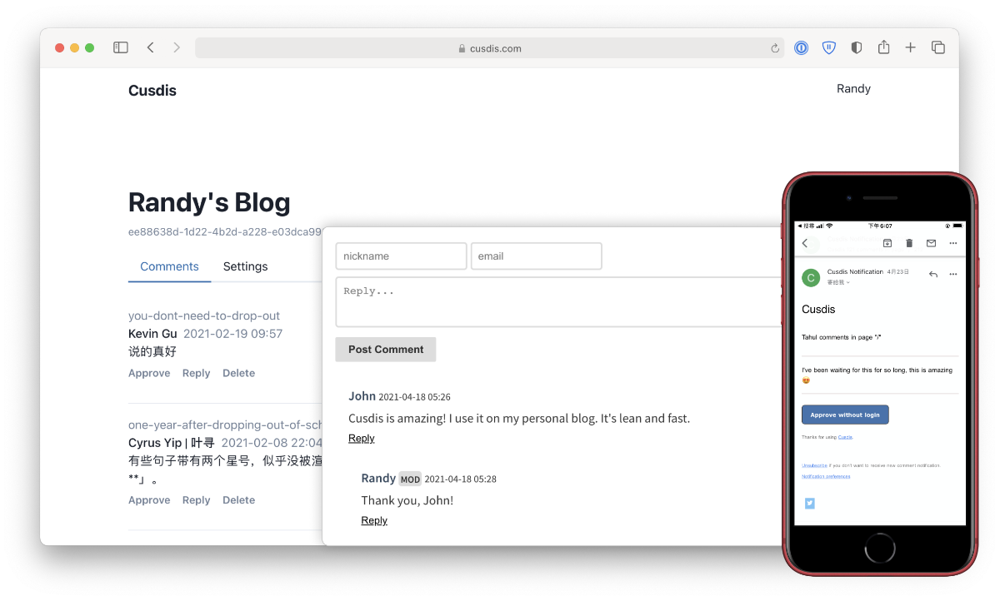

<!--
NB: Deze README is automatisch gegenereerd door <https://github.com/YunoHost/apps/tree/master/tools/readme_generator>
Hij mag NIET handmatig aangepast worden.
-->

# Cusdis voor Yunohost

[](https://ci-apps.yunohost.org/ci/apps/cusdis/)  

[](https://install-app.yunohost.org/?app=cusdis)

*[Deze README in een andere taal lezen.](./ALL_README.md)*

> *Met dit pakket kun je Cusdis snel en eenvoudig op een YunoHost-server installeren.*  
> *Als je nog geen YunoHost hebt, lees dan [de installatiehandleiding](https://yunohost.org/install), om te zien hoe je 'm installeert.*

## Overzicht

Cusdis is an open-source, lightweight (~5kb gzip), privacy-friendly alternative to Disqus.

###Features

- Lightweight comment widget, with i18n, dark mode.
- Email notification
- Webhook
- Easy to self-host
- Many integrations


**Geleverde versie:** 1.3.0~ynh1

## Schermafdrukken



## Documentatie en bronnen

- Officiele website van de app: <https://cusdis.com/>
- Officiele beheerdersdocumentatie: <https://cusdis.com/doc#/self-host/manual>
- Upstream app codedepot: <https://github.com/djyde/cusdis>
- YunoHost-store: <https://apps.yunohost.org/app/cusdis>
- Meld een bug: <https://github.com/YunoHost-Apps/cusdis_ynh/issues>

## Ontwikkelaarsinformatie

Stuur je pull request alsjeblieft naar de [`testing`-branch](https://github.com/YunoHost-Apps/cusdis_ynh/tree/testing).

Om de `testing`-branch uit te proberen, ga als volgt te werk:

```bash
sudo yunohost app install https://github.com/YunoHost-Apps/cusdis_ynh/tree/testing --debug
of
sudo yunohost app upgrade cusdis -u https://github.com/YunoHost-Apps/cusdis_ynh/tree/testing --debug
```

**Verdere informatie over app-packaging:** <https://yunohost.org/packaging_apps>
