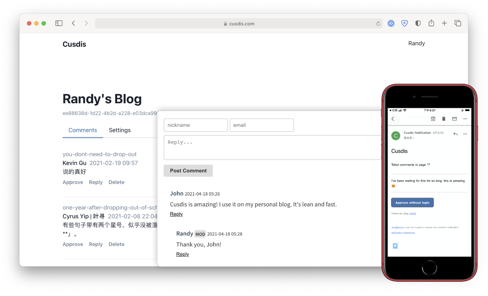

<!--
To README zostało automatycznie wygenerowane przez <https://github.com/YunoHost/apps/tree/master/tools/readme_generator>
Nie powinno być ono edytowane ręcznie.
-->

# Cusdis dla YunoHost

[](https://ci-apps.yunohost.org/ci/apps/cusdis/)


[](https://install-app.yunohost.org/?app=cusdis)

*[Przeczytaj plik README w innym języku.](./ALL_README.md)*

> *Ta aplikacja pozwala na szybką i prostą instalację Cusdis na serwerze YunoHost.*  
> *Jeżeli nie masz YunoHost zapoznaj się z [poradnikiem](https://yunohost.org/install) instalacji.*

## Przegląd

Cusdis is an open-source, lightweight (~5kb gzip), privacy-friendly alternative to Disqus.

###Features

- Lightweight comment widget, with i18n, dark mode.
- Email notification
- Webhook
- Easy to self-host
- Many integrations


**Dostarczona wersja:** 1.3.0~ynh1

## Zrzuty ekranu



## Dokumentacja i zasoby

- Oficjalna strona aplikacji: <https://cusdis.com/>
- Oficjalna dokumentacja dla administratora: <https://cusdis.com/doc#/self-host/manual>
- Repozytorium z kodem źródłowym: <https://github.com/djyde/cusdis>
- Sklep YunoHost: <https://apps.yunohost.org/app/cusdis>
- Zgłaszanie błędów: <https://github.com/YunoHost-Apps/cusdis_ynh/issues>

## Informacje od twórców

Wyślij swój pull request do [gałęzi `testing`](https://github.com/YunoHost-Apps/cusdis_ynh/tree/testing).

Aby wypróbować gałąź `testing` postępuj zgodnie z instrukcjami:

```bash
sudo yunohost app install https://github.com/YunoHost-Apps/cusdis_ynh/tree/testing --debug
lub
sudo yunohost app upgrade cusdis -u https://github.com/YunoHost-Apps/cusdis_ynh/tree/testing --debug
```

**Więcej informacji o tworzeniu paczek aplikacji:** <https://yunohost.org/packaging_apps>
